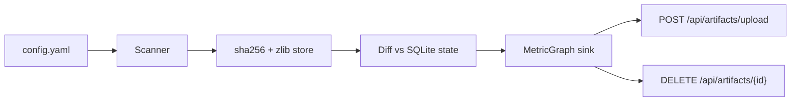

# Ingest Engine

Polls a configured list of file paths, **hashes and compresses** each file's content, detects **ADDED / MODIFIED / REMOVED** changes, and pushes updates into **MetricGraph** (or logs events in dry-run mode).

## What it does



On **MODIFIED**, the engine deletes the previous MetricGraph artifact (if `delete_on_change: true`) and re-uploads the new version so clusters and issues stay correct.

## Quick start

### 1. MetricGraph must be running

```bash
cd ../metricgraph
docker compose up -d
```

MetricGraph needs the `DELETE /api/artifacts/{id}` endpoint (added for this project).

### 2. Install and configure

```bash
cd ingest_engine
python3 -m venv .venv
source .venv/bin/activate
pip install -r requirements.txt

cp config.example.yaml config.yaml
# Edit watch paths and MetricGraph base_url if needed
```

### 3. Run

**Single scan** (good for testing):

```bash
python -m ingest.cli scan-once -c config.yaml
```

**Continuous polling**:

```bash
python -m ingest.cli run -c config.yaml
```

**Status**:

```bash
python -m ingest.cli status -c config.yaml
```

## Config (`config.example.yaml`)

```yaml
watch:
  - path: ../metricgraph/demo/investment_ops_demo
    recursive: true
    include: ["*.xlsx", "*.sql", "*.dax", "*.py"]
    exclude: ["*.csv"]
poll_interval_seconds: 5
store_dir: ./.ingest_store
state_db: ./.ingest_state.db
compression_level: 6
sink:
  type: metricgraph   # or "log" for dry-run
  metricgraph:
    base_url: http://localhost:8000
    delete_on_change: true
    owner: Investment Operations
```

| Field | Description |
|-------|-------------|
| `watch[].path` | File or directory to watch |
| `watch[].include` / `exclude` | Glob filters |
| `poll_interval_seconds` | How often to scan (polling only) |
| `store_dir` | Content-addressed zlib-compressed blob store |
| `state_db` | SQLite manifest (path → hash → artifact_id) |
| `sink.type` | `metricgraph` or `log` |

## Change detection

| Event | Condition |
|-------|-----------|
| `ADDED` | Path not in state |
| `MODIFIED` | Path in state, `sha256` content hash changed |
| `REMOVED` | Path in state, file missing on disk |
| no-op | Same hash (short-circuits on size+mtime before re-hashing) |

## Content store

- Each file version is identified by `sha256(content)`.
- Compressed with zlib at `compression_level` (default 6).
- Stored at `store_dir/<hash[:2]>/<hash>.zz`.
- Identical content is stored once (dedup).

## MetricGraph integration

| Event | Action |
|-------|--------|
| ADDED | `POST /api/artifacts/upload` → save `artifact_id` in state |
| MODIFIED | `DELETE` old artifact → `POST upload` → update `artifact_id` |
| REMOVED | `DELETE` artifact |

Unsupported extensions are skipped (only formula artifacts, not raw CSV datasets).

## CLI

```bash
python -m ingest.cli run -c config.yaml          # continuous loop
python -m ingest.cli scan-once -c config.yaml  # one pass
python -m ingest.cli status -c config.yaml     # tracked files + events
python -m ingest.cli -v scan-once              # verbose logging
```

## Tests

```bash
pytest
```

## Live edit demo

1. Start MetricGraph and the ingest engine (`run`).
2. Edit `deal_irr_queries.sql` in the watched folder.
3. Within one poll interval, the engine detects `MODIFIED`, re-uploads to MetricGraph, and the worker re-parses the file.
4. Check Discovery dashboard for updated clusters/issues.

## Project layout

```
ingest_engine/
├── config.example.yaml
├── ingest/
│   ├── config.py       # YAML loader
│   ├── hashing.py      # sha256
│   ├── store.py        # zlib content-addressed store
│   ├── state.py        # SQLite manifest + event log
│   ├── scanner.py      # path expansion + hashing
│   ├── diff.py         # ADDED/MODIFIED/REMOVED
│   ├── engine.py       # orchestration loop
│   ├── cli.py          # run / scan-once / status
│   └── sinks/
│       ├── log_sink.py
│       └── metricgraph_sink.py
└── tests/
```
